<div align="center">

# SignalSentinel

**Competitor-change intelligence on webcmd**

Your competitors changed their pricing, features, or positioning — and you found out three weeks late, by accident. SignalSentinel watches their real sites, tells you exactly **what** changed, **what it means**, and **what to do** — and repairs its own command library when those sites change.

[](https://www.npmjs.com/package/signal-sentinel)
[](https://github.com/shashank-tomar0/signal-sentinel)

</div>

---

## Why this exists

Competitor intelligence is a real, painful problem that people pay to solve. Most "monitors" are just price tickers or noisy page diffs.

| What others do | What SignalSentinel does |
|---|---|
| String diffs / price tickers | **Structural, semantic diff** — new tier added, trial removed, pricing restructured |
| One-shot scrape | **Explore once → compile to a fast command → reuse forever** (sub-second, ~90% fewer tokens) |
| Breaks silently when a site changes | **Self-healing** — detects breakage, re-explores, rebuilds the adapter, goes green |
| Raw data dump | **Plain-language brief** — "Annotate jumped to #1 on Product Hunt; likely a launch push. Monitor." |

---

## Install

```bash
npm install -g signal-sentinel
```

That's it — `sentinel` is on your PATH. Works on **Node 20+** on macOS, Linux, and Windows.

> To run it from source instead: `git clone https://github.com/shashank-tomar0/signal-sentinel && cd signal-sentinel && npm install && npm link`.

---

## Quick start

```bash
# 1. Set your Groq key for AI briefs (optional — a deterministic fallback works without it)
#    Create a .env in the directory where you'll run sentinel:
echo "GROQ_API_KEY=your_key_here" > .env

# 2. Create config
sentinel init

# 3. Register a real site. Everything after `--` is passed to webcmd (no quoting pain).
sentinel target add acme-pricing \
  --site coingecko \
  --command top \
  --watch "price,marketCap" \
  --key symbol \
  -- --limit 10

# 4. First run = establish baseline
sentinel watch acme-pricing

# 5. Subsequent runs = diff vs baseline
sentinel watch acme-pricing

# 6. Get the AI narrative brief
sentinel brief acme-pricing

# 7. Or run continuously
sentinel daemon --force
```

---

## What you get

A plain-language brief, generated in real time by Groq from the actual diff — this is a real output:

```markdown
# ph-today — brief (2026-08-06)

**1. What changed**
Product Hunt's daily rankings have shifted, with Brandfetch MCP jumping to
1st place and Cloudflare OS dropping to 2nd. Annotate, UCP Radar, and Aveiro
also fell, while Muse Code rose to 3rd.

**2. What it likely means for the competitor/market**
This suggests shifting user interest or voting patterns. Brandfetch MCP's
sudden rise may indicate a successful launch or marketing campaign.

**3. Suggested attention or next step**
Monitor Brandfetch MCP's product and marketing strategy. Analyze user
feedback to identify improvement areas for our own product, and consider
adjusting our launch strategy to stay competitive.
```

No browser rendering, no screenshot reasoning — just a deterministic command returning clean JSON, diffed against a baseline, turned into insight.

---

## How it works

```mermaid
flowchart LR
    subgraph CLI["Sentinel CLI — the thin product shell"]
        direction TB
        CMD[watch · diff · brief · repair · daemon · status]
        DE[Diff Engine<br/>schema-aware]
        SC[Signal Classifier]
        BG[Brief Generator<br/>Groq LLM]
    end

    subgraph WEBCMD["webcmd runtime — @agentrhq/webcmd"]
        direction TB
        EXPLORE[Explore once<br/>browser + sitemap]
        COMPILE[Compile to<br/>webcmd site command]
        REUSE[Reuse fast commands<br/>sub-second · ~500 tokens]
        AUTOFIX[Autofix<br/>self-heal when sites change]
    end

    subgraph STATE["State — git-tracked"]
        TARGETS[Target Registry<br/>sites + fields to watch]
        SNAP[.sentinel/targets/<br/>baseline.json · history.jsonl · brief.md]
    end

    WEBCMD -->|reads/writes| STATE
    STATE --> CLI
    CLI -->|calls| WEBCMD
```



**Key insight:** SignalSentinel is *not* a browser agent. [webcmd](https://www.npmjs.com/package/@agentrhq/webcmd) does the heavy lifting — explore, compile, reuse, self-heal. SignalSentinel is the **thin orchestration layer** that points that capability at a real business problem and turns raw signals into a human-readable brief — the **compounding asset**: a library of learned commands that keeps itself alive.

*This diagram renders live on GitHub (Mermaid). Editable hand-drawn versions are in the [Visual overview](#visual-overview) below.*

---

## The self-healing loop

When a watched site changes its structure, the command breaks. Sentinel:

1. **Detects** the failure on the next watch
2. **Attempts autonomous repair** — re-verify → re-explore (`webcmd browser`) → rebuild the adapter → re-verify
3. **Succeeds silently** if it heals itself
4. **Escalates to a human** with an exact protocol if it can't:

```bash
REPAIR PROTOCOL (automate with Claude Code + webcmd skills):
  1. webcmd browser <site>          # re-explore the live surface
  2. webcmd-sitemap-author           # refresh sitemap memory
  3. webcmd-adapter-author           # rebuild the <command> command
  4. webcmd verify <site> <command>  # confirm schema
  5. sentinel watch <name>           # re-baseline
```

---

## Visual overview

| Diagram | What it shows |
|---|---|
| **Demo flow** | The 5-stage live demo arc: Library → Reuse → Watch & Signals → Intelligence → Self-heal |
| **User flow** | How you actually use it: setup → baseline → watch loop → signal decision → brief / act → self-heal |


<a href="commands-reference.png"></a>

Both are editable — open the `.excalidraw` sources in [excalidraw.com](https://excalidraw.com) (handwritten Virgil font) or install the [Excalidraw MCP](https://github.com/excalidraw/excalidraw-mcp) to edit programmatically.

---

## Commands

| Command | Purpose |
|---|---|
| `sentinel init` | Create `.sentinel` config |
| `sentinel target list` | List registered targets |
| `sentinel target add <name> --site <s> --command <c> [-- <args>]` | Register a real surface |
| `sentinel target rm <name>` | Remove a target |
| `sentinel watch <name> \| all` | Run, diff vs baseline, update baseline |
| `sentinel diff <name>` | Show last diff without updating baseline |
| `sentinel brief <name> [--last]` | Generate AI brief (or show last persisted) |
| `sentinel status` | Library health: clean / changed / broken |
| `sentinel history <name>` | Recent run history |
| `sentinel repair <name>` | Diagnose → auto-repair → manual protocol |
| `sentinel daemon [--force]` | Continuous watch loop (scheduler) |
| `sentinel run` | Force-run all due targets once |
| `sentinel demo [--target <name>]` | Run the full 5-beat live demo arc |
| `sentinel state` | Show config + state paths |

---

## Use cases

| Target | Command | Watches | Example signal |
|---|---|---|---|
| `ph-today` | `producthunt today` | Today's launches, rank moves | "Annotate jumped to #1" |
| `gh-trending` | `github-trending repos` | Trending repos by language | "cloudflare/computer forks +6" |
| `crypto-top` | `coingecko top` | Top-10 coin prices | "BTC market cap -$3M (noise suppressed)" |
| `webcmd-npm` | `npm package @agentrhq/webcmd` | webcmd's own npm version | "0.8.x → 0.9.0" |
| `hn-webcmd` | `hackernews search webcmd` | HN buzz about webcmd | "New story +3 points" |
| `pypi-requests` | `pypi package requests` | The `requests` PyPI package | "version bump" |

These run **live** against real public APIs — no mocks.

---

## Requirements

- **Node** ≥ 20
- **[webcmd](https://www.npmjs.com/package/@agentrhq/webcmd)** — `npm install -g @agentrhq/webcmd` (the browser runtime Sentinel shells out to)
- **Groq API key** (optional — a deterministic fallback brief works without it)

---

## One-command demo

```bash
sentinel demo          # runs the full 5-beat live arc on a real target
```

`sentinel demo` walks through the whole story automatically — library health, live diff, AI brief, self-heal — on real data. Great for demos and recording.

---

## Full manual walkthrough

```bash
./demo.sh              # you drive — every command, real data, press Enter to advance
```

`demo.sh` runs the complete end-to-end flow you'd show a judge: init → register target → baseline → diff → status → history → AI brief → state → run → repair. Each step pauses so you can narrate.

---

## License

[MIT](LICENSE)