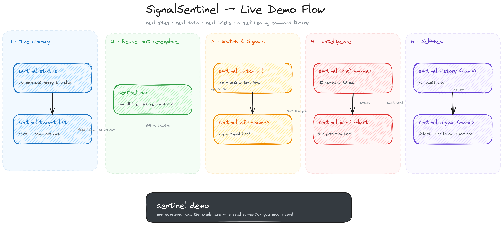
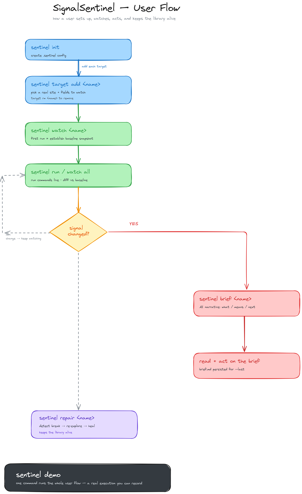

# SignalSentinel

> **Your competitors changed their pricing, features, or positioning — and you found out three weeks late, by accident.**
>
> SignalSentinel watches their real sites, tells you exactly *what* changed, *what it means*, and *what to do* — and it repairs its own command library when those sites change.

---

## Why this exists

Competitor intelligence is a real, painful problem that people pay for (the previous webcmd hackathon winner built exactly this). But most "monitors" are just price tickers or noisy page diffs.

| What others do | What Sentinel does |
|---|---|
| String diffs / price tickers | **Structural, semantic diff** — new tier, removed trial, price restructure |
| One-shot scrape | **Explore once → compile to fast command → reuse forever** (sub-second, ~90% fewer tokens) |
| Broken when site changes | **Self-healing** — detects breakage, re-explores, rebuilds adapter, goes green |
| Raw data dump | **Plain-language brief** — "Keystroke jumped to #1 on Product Hunt; likely a launch push. Monitor." |

---

## How it works (the architecture)

```mermaid
flowchart LR
    subgraph CLI["Sentinel CLI — the thin product shell"]
        direction LR
        CMD[watch · diff · brief · repair · daemon · status]
        DE[Diff Engine<br/>schema-aware]
        SC[Signal Classifier]
        BG[Brief Generator<br/>Groq LLM]
    end

    subgraph WEBCMD["webcmd runtime — @agentrhq/webcmd"]
        direction TB
        EXPLORE[Explore once<br/>browser + sitemap]
        COMPILE[Compile to<br/>webcmd &#60;site&#62; &#60;cmd&#62;]
        REUSE[Reuse fast commands<br/>sub-second · ~500 tokens]
        AUTOFIX[Autofix<br/>self-heal when sites change]
    end

    subgraph STATE["State — git-tracked"]
        TARGETS[Target Registry<br/>sites + fields to watch]
        SNAP[.sentinel/targets/<br/>baseline.json · history.jsonl · brief.md]
    end

    WEBCMD -->|reads/writes| STATE
    STATE --> CLI
    CLI -->|calls| WEBCMD
```



**Key insight:** You are *not* building a browser agent. webcmd does the actual work — explore, compile, reuse, and self-heal. Sentinel (the CLI) is the **thin orchestration layer** that points that capability at a real business problem and turns raw signals into a human-readable brief.

> `demo-flow.png`, `commands-reference.png`, and the `.excalidraw` sources give editable, hand-drawn versions. This Mermaid block renders live inline on GitHub — update the code, the diagram updates.

---

## Visual overview

| Diagram | What it shows |
|---|---|
| **Demo flow** | The 5-stage live demo arc: Library → Reuse → Watch & Signals → Intelligence → Self-heal, with every command and what happens under the hood |
| **User flow** | How you actually use Sentinel: setup → baseline → watch loop → signal decision → brief/act → self-heal |





*Both diagrams are editable Excalidraw sources (Virgil handwritten font) — open in [excalidraw.com](https://excalidraw.com) to edit.*

---

## Quick start

```bash
# 1. Install the platform
npm install -g @agentrhq/webcmd   # Node 20+
webcmd skills add                 # installs 7 agent skills

# 2. Clone & link
git clone https://github.com/shashank-tomar0/signal-sentinel
cd signal-sentinel
npm install

# 3. Add your Groq key for AI briefs (or use deterministic fallback)
cp .env.example .env
# edit .env → GROQ_API_KEY=your_key

# 4. Run
npm link                      # exposes `sentinel` on PATH
sentinel init
```

### Register a real target

```bash
# Everything after `--` is passed to webcmd as positional args (no quoting pain)
sentinel target add acme-pricing \
  --site coingecko \
  --command top \
  --watch "price,marketCap" \
  --key symbol \
  -- --limit 10
```

### The core loop

```bash
# First run = establish baseline
sentinel watch acme-pricing

# Subsequent runs = diff vs baseline
sentinel watch acme-pricing

# Get the AI narrative brief
sentinel brief acme-pricing

# Or view the last persisted brief from the daemon
sentinel brief acme-pricing --last

# Run continuously
sentinel daemon --force
```

---

## Real demo targets (working today)

| Target | Command | What it watches | Signal example |
|---|---|---|---|
| `ph-today` | `producthunt today` | Today's launches, rank moves | "Annotate jumped to #1" |
| `gh-trending` | `github-trending repos` | Trending repos by language | "cloudflare/computer forks +6" |
| `crypto-top` | `coingecko top` | Top-10 coin prices/market cap | "BTC market cap -$3M (noise suppressed)" |
| `webcmd-npm` | `npm package @agentrhq/webcmd` | webcmd's own npm version | "0.8.x → 0.9.0 published" |
| `hn-webcmd` | `hackernews search webcmd` | HN buzz about webcmd | "New story +3 points" |
| `pypi-requests` | `pypi package requests` | The `requests` lib on PyPI | "version 2.32.4 → 2.33.0" |

> These run **live** against real public APIs. No mocks. The briefs above are real Groq outputs from the last run.

---

## Commands reference

| Command | Purpose |
|---|---|
| `sentinel init` | Initialize config |
| `sentinel target list` | List registered targets |
| `sentinel target add <name> --site <s> --command <c> [-- <args>]` | Register a real surface (args after `--`) |
| `sentinel target rm <name>` | Remove a target |
| `sentinel watch <name> \| all` | Run command, diff vs baseline, update baseline |
| `sentinel diff <name>` | Show last diff without updating baseline |
| `sentinel brief <name> [--last]` | Generate AI brief, or show last persisted |
| `sentinel status` | Library health: clean / changed / broken |
| `sentinel history <name>` | Recent run history |
| `sentinel repair <name>` | Diagnose → autonomous repair → manual protocol |
| `sentinel daemon [--force]` | Continuous watch loop (scheduler) |
| `sentinel run` | Force-run all due targets once |
| `sentinel demo [--target <name>]` | Run the full 5-beat live demo arc (no input) |
| `sentinel state` | Show sentinel dir + config path |

---

## The self-healing loop (technical depth)

When a watched site changes its structure, the command breaks. Sentinel:

1. **Detects** the failure on the next watch
2. **Attempts autonomous repair** — re-verify → re-explore (`webcmd browser`) → rebuild adapter (`adapter-author`/`autofix`) → re-verify
3. **Succeeds silently** if the adapter heals itself
4. **Escalates to human** with an exact re-education protocol if it can't:

```
REPAIR PROTOCOL (automate with Claude Code + webcmd skills):
  1. webcmd browser <site>          — re-explore the live surface
  2. webcmd-sitemap-author           — refresh sitemap memory
  3. webcmd-adapter-author           — rebuild the <command> command
  4. webcmd verify <site> <command>  — confirm schema
  5. sentinel watch <name>           — re-baseline
```

This is the **"compounding asset"** — a library of learned commands that keeps itself alive.

---

## Why it wins (scorecard mapping)

| Rubric (100) | How Sentinel earns it |
|---|---|
| **Live reliability (30)** | Read-only public surfaces → no payments/logins/submissions → trivially satisfies hard rules. Deterministic commands, real-time Groq briefs. |
| **Usefulness (25)** | Proven market: competitor intelligence. Real pain, real ROI. The previous hackathon winner built exactly this. |
| **Technical depth (20)** | Explore → compile → reuse → self-heal (webcmd's deepest loop). Autonomous repair attempts before human fallback. |
| **Creativity (15)** | Structural change detection (not price ticker), plain-language AI briefs, compounding command library. |
| **Demo & storytelling (10)** | Live arc: watch → real signal → AI brief → break a site → self-heal. Watchable by non-technical judges. |

---

## License

MIT